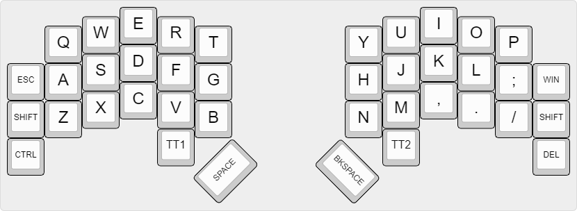
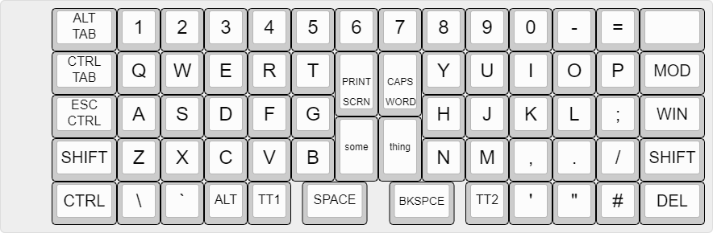

# Keyboard Firmware

## The Ergobecular  
The Ergobecular is a split mechanical keyboard design, designed to be hackable, configurable and customisable. I intend for it to have two versions, one compatible with MX type switches, and one compatible with low profile Kailh Choc switches.  

The primary inspirations for the design are a combination of the Ergodox, and the Ferris Sweep and Gergoplex.  

I'd like to include a small screen for displaying information. I like the idea of having it pull system time, as well as displaying layer information. I think it could even be used for fun little gimicks like a compass or something, I'm not sure.  

The entire design will be completely open source for you to fork, configure, customise and tweak as you please. 

  

## The EBPlank75
The design of this board will be fundamentally similar to the Ergobecular, but with a few key differences. The first is that it will be a plank keyboard design, rather than a split one.  

It will also be more of a 75% layout including a number row and various modifier keys. The Ergobecular, on the other hand, is closer to a 40%, lacking any dedicated number keys.  

I think these design choices might make it more accessible to some people who are interested in weirder keyboards, but aren't quite ready to make the jump to a split type yet. This will provide a stepping stone into custom layouts and weird keymaps, as well as the ortholinear layout type, without being too daunting.  

The other advantage for me personally is that I can use an aftermarket case that I've got lying around my office. It will also allow me the opportunity to learn how to design circuit boards without having to worry about the complexities of having two keyboard halves talking to one another.  

Primarily, however, it will carry the same design ethos as the Ergobecular, focussing on being open source and configurable, as well as using 1 to 1.5 unit keys so that you don't have to worry about stabilisers, and can focus on tweaking keymaps and choosing switches.  

Also I couldn't think of a better name, so it's the EBPlank75, which just stands for Ergobecular Plank 75, but lets quietly pretend I gave it a cooler name.

  

## Ergodox firmware  
This is the firmware that's actually completed, and the ergobecular will be very similar, but more minimal.  

The Ergodox firmware contains both the source and a compiled hex file for my Ergodox layout. I have made some tweaks and compiled from source, which is why I include the files rather than just dropping a link to the Oryx page.  

My Ergodox is the Shine variant, so if you have the Glow or non LED variants, it might be prudent to download the necessary firmware and do a diff to see where changes need to be made.  

My standard for laying out the firmware is that each column should be 3 spaces away from the longest line on the previous column. This should make it easier to read.  

It's also worth noting that you may run into compile errors if you're on ZSA's branch firmware20 or lower. Firmware 21 is needed for CAPS_WORD

  

Do let me know what you think of the keyboards when they're done and what you think of the layouts I've written for them because I'd be very interested to know if anyone else can actually use them. 

Cheers,  
~ Iain xx
