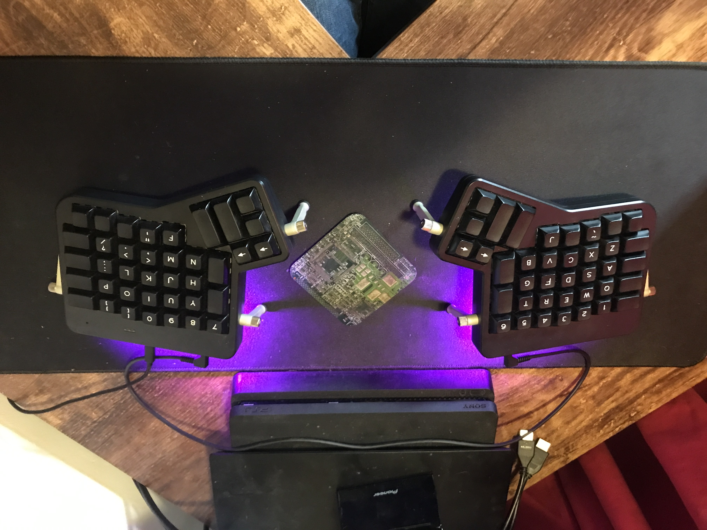

# Keyboard Firmware

## The Ergobecular  
The Ergobecular is a custom open source keyboard design based partly on the Ergodox EZ and partly on things like the Ferris Sweep or the Gergoplex.  
It's a low profile, programmable keyboard which is designed to be made, customised, tweaked and shared.  
The initial design will be designed for Kailh Choc low profile switches and will include a keymap designed for my layout, a screen for information, and a custom ZMK fork.  
All of this will be included in it's entirety for you to do with as you please.  
I hope you enjoy my mad behaviour and enjoy the keyboard  

## Ergodox firmware  
This is the firmware that's actually completed, and the ergobecular will be very similar, but more minimal.  
The Ergodox firmware contains both the source and a compiled hex file for my Ergodox layout. I have made some tweaks and compiled from source, which is why I include the files rather than just dropping a link to the Oryx page.  
My Ergodox is the Shine variant, so if you have the Glow or non LED variants, it might be prudent to download the necessary firmware and do a diff to see where changes need to be made.  
It's also worth noting that you may run into compile errors if you're on ZSA's branch firmware20 or lower. Firmware 21 is needed for CAPS_WORD

  

Do let me know what you think of the keyboards when they're done and what you think of the layouts I've written for them because I'd be very interested to know if anyone else can actually use them. 

Cheers,  
~ Iain xx
