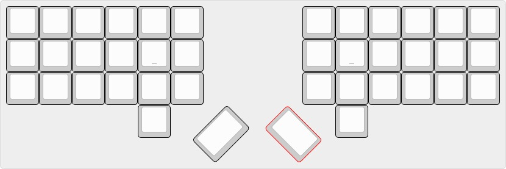

# Keyboard Firmware

## The Ergobecular  
The Ergobecular is a layout for a customisable, ergonomic mechanical keyboard. While it's based on my personal layout and preferences, it's designed to be configured and customised to the needs and preferences of you, the user.  
One of the primary choices made is to focus on smaller key sizes, never going above 1.5 unit keys. This way, stabilisers are completely unneeded, which will make tuning them for acoustics much easier. 

The main choice will be whether you want a split board, or a plank. In the future, I'd like to create a kind of Alice like design, but for the time being these will be the two main options.  
In the split category, you'll also be able to choose between columnar and fully ortholinear, while the plank will just be fully ortho for standard case compatibility.  
You'll also need to choose whether you want MX compatible sockets, or Kailh choc compatible sockets. 

Once I've finished making the designs, you should be able to just grab the PCB files you want from this repo and upload them to your PCB manufacturer of choice.  
Finally, I'll have not only firmware source files for you to start from, I'll also have a precompiled hex file for you to flash straight to the board if you don't have QMK configured, and don't mind using my layout. 

When the project is further along, a proper build guide will be available here as well. 

## The EBSplit  
The split version of the Ergobecular is probably the most customisable, as not only does it have options for all the different switches, you can also choose between columnar or fully ortho.  

This version of the board is likely going to be more ergonomic than the plank version, and more versatile if you've got the setup to handle it, but less portable.  
It'll need an extra TRRS cable to connect the halves, and you'll have to remember to carry around both halves of it, plus additional unpacking time.  
If you're the type of person who moves between home and the office, this might not be the way to go. 

I'd like to include a small screen for displaying information in this version, as I like the idea of having it pull system time, as well as displaying layer information.  
I think it could even be used for fun little gimmicks like a compass or something, I'm not sure. Being programmable, I'm sure people will be able to think of some fun stuff to do with this. 

  

  

## The EBPlank  
The plank version is designed either for someone who's not so fussed about a split design, or has a greater need for portability.  
While a split keyboard is portable, you can't quite throw it into a bag the same way you can with a regular keyboard.  

Because of this, as well as the slightly larger form factor, I see this as being a slightly more beginner friendly variant of the board.  
A stepping stone for someone who's tentatively interested in building their own keyboard, and wants to try a non-staggered layout, but isn't fully ready to commit to the split.  
This will also help someone get more used to designing their own layouts, although it would definitely be easier to get a ZSA keyboard, as their online layout tool is excellent, and very easy to use. 

I'm going to build one of these myself so that I can take it with me when I go away so I won't have to switch back to a more standard keyboard.  
Although that does mean I'm probably going to have to put silent switches in it.  

This will also be designed for compatibility with a lot of generic 60% cases, as this is a 60% keeb, rather than the split variant which is closer to a 40%.  
The case I'll be using for reference is a Miller GM862 which I've got sat on my shelf, but I'm going to try and include screw holes in standard places where possible.  
If you run into any issues with aftermarket cases, please send me an email to let me know.  
If it's just a one off thing I can't promise I'll be able to do much, but if I get multiple people telling me it doesn't fit common cases I'll definitely see what i can do. 

  

## Firmware  
This directory is where I'll keep various firmware files for the keyboards, including source and a precompiled hex file.  

I've already got the firmware to my ErgodoxEZ layout, so if you've got an Ergodox and want to give my layout a try, this is the place to get it.  
The difference between this version and the one made using ZSA's online configuration tool is that this has layer switch on macros available, which ZSA does not have. 

My Ergodox is the Shine variant, so if you have the Glow or non LED variants, it might be prudent to download the necessary firmware and do a diff to see where changes need to be made.  
Also if you've got a Moonlander, you might also have to make some tweaks to the layout in order to make it work. I've been meaning to design a layout in case I ever get one, but I've not got around to it yet. 

My standard for laying out the firmware is that each column should be 3 spaces away from the longest line on the previous column. This should make it easier to read.  

NOTE: You may run into compile errors if you're on ZSA's branch firmware20 or lower. Firmware 21 is needed for CAPS_WORD, which I am using. 

  

todo:  
 
        - [ ] Design variants for 
                - [ ] split columnar MX 
                - [ ] split ortho MX
                - [ ] split columnar Choc
                - [ ] split ortho Choc
                - [ ] Plank MX
                - [ ] Plank Choc
        - [ ] Design and compile firmware for all of these
        - [ ] Design cases and plates for 3D printing

done:

        - [x] Write a design brief

Please do get in touch and let me know what you think of the designs and if you've used any of them. (when they're done of course) Feedback is always appreciated. 

Cheers,  
~ Iain xx
